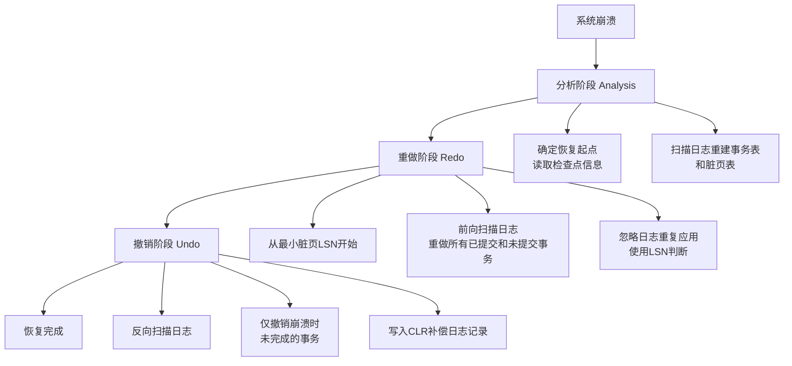

# WAL（Write-Ahead Log）崩溃恢复原理技术文档

## 1. 概述

### 1.1 文档目的
本文档详细阐述WAL（Write-Ahead Log，预写日志）在数据库系统崩溃恢复中的核心原理、工作机制和实现机制，为数据库开发者和系统架构师提供深入的技术参考。

### 1.2 核心概念
- **WAL基本原理**：所有数据修改必须先写入持久化的日志文件，然后才能写入数据文件
- **崩溃恢复目标**：保证数据库在意外崩溃后的**ACID特性**，特别是持久性（Durability）和原子性（Atomicity）
- **恢复核心**：通过重放日志将数据库恢复到崩溃前的一致状态

## 2. WAL架构设计

### 2.1 日志记录结构
```python
class WALRecord:
    def __init__(self):
        self.LSN = 0          # 日志序列号（唯一标识）
        self.TransactionID = 0 # 事务ID
        self.PrevLSN = 0      # 同一事务上一条日志的LSN
        self.Type = ''        # 日志类型：BEGIN/UPDATE/COMMIT/ABORT
        self.PageID = 0       # 修改的数据页ID
        self.Offset = 0       # 页内偏移量
        self.OldData = b''    # 修改前数据（用于UNDO）
        self.NewData = b''    # 修改后数据（用于REDO）
        self.Checksum = 0     # 完整性校验
```

### 2.2 关键组件
```
┌─────────────────────────────────────────────┐
│                WAL系统架构                   │
├─────────────────────────────────────────────┤
│ 1. 日志缓冲区 (Log Buffer)                   │
│    - 内存中的日志缓存区                      │
│    - 批量刷盘优化                           │
├─────────────────────────────────────────────┤
│ 2. 日志文件 (Log Files)                     │
│    - 顺序写入的持久化文件                    │
│    - 分段存储和循环使用                      │
├─────────────────────────────────────────────┤
│ 3. 检查点机制 (Checkpoint)                  │
│    - 定期创建恢复点                         │
│    - 减少恢复时间                           │
├─────────────────────────────────────────────┤
│ 4. LSN管理 (Log Sequence Number)           │
│    - 全局单调递增的日志序号                  │
│    - 用于恢复和并发控制                      │
└─────────────────────────────────────────────┘
```

## 3. 崩溃恢复原理

### 3.1 恢复算法：ARIES（工业标准）


### 3.2 恢复三阶段详解

#### 阶段一：分析阶段（Analysis Phase）
```python
def analysis_phase(checkpoint_lsn):
    """
    分析阶段：确定恢复的起始点
    """
    # 1. 读取最近的检查点记录
    checkpoint = read_checkpoint_record()
    
    # 2. 初始化数据结构
    active_transactions = checkpoint.active_txns.copy()
    dirty_page_table = checkpoint.dirty_pages.copy()
    
    # 3. 从检查点开始扫描日志
    current_lsn = checkpoint_lsn
    while log_record := read_log_record(current_lsn):
        if log_record.type == 'UPDATE':
            # 更新脏页表：记录页面最早修改的LSN
            dirty_page_table[log_record.page_id] = min(
                dirty_page_table.get(log_record.page_id, INF),
                log_record.lsn
            )
        elif log_record.type == 'COMMIT':
            # 从活动事务表中移除
            active_transactions.remove(log_record.txn_id)
        elif log_record.type == 'BEGIN':
            # 添加到活动事务表
            active_transactions.add(log_record.txn_id)
            
        current_lsn = log_record.next_lsn
    
    return {
        'redo_start_lsn': min(dirty_page_table.values()),
        'active_transactions': active_transactions,
        'dirty_page_table': dirty_page_table
    }
```

#### 阶段二：重做阶段（Redo Phase）
```python
def redo_phase(redo_start_lsn, dirty_page_table):
    """
    重做阶段：确保所有已提交的修改持久化
    """
    # 从最小的脏页LSN开始重做
    current_lsn = redo_start_lsn
    
    while log_record := read_log_record(current_lsn):
        if log_record.type == 'UPDATE':
            # 检查是否需要重做（幂等性保证）
            page_lsn = get_page_lsn(log_record.page_id)
            
            if (log_record.page_id in dirty_page_table and 
                log_record.lsn >= dirty_page_table[log_record.page_id] and
                log_record.lsn > page_lsn):
                
                # 应用修改到数据页
                apply_update(
                    log_record.page_id,
                    log_record.offset,
                    log_record.new_data
                )
                
                # 更新页面的LSN
                set_page_lsn(log_record.page_id, log_record.lsn)
        
        current_lsn = log_record.next_lsn
```

#### 阶段三：撤销阶段（Undo Phase）
```python
def undo_phase(active_transactions):
    """
    撤销阶段：回滚崩溃时未完成的事务
    """
    # 收集需要撤销的日志记录
    undo_records = []
    for txn_id in active_transactions:
        # 从每个活动事务的最后一条日志开始
        last_lsn = get_last_lsn_of_transaction(txn_id)
        undo_records.extend(collect_undo_chain(txn_id, last_lsn))
    
    # 按LSN降序排序（反向撤销）
    undo_records.sort(key=lambda x: x.lsn, reverse=True)
    
    for record in undo_records:
        # 应用撤销操作
        apply_update(
            record.page_id,
            record.offset,
            record.old_data  # 使用旧数据恢复
        )
        
        # 写入CLR（Compensation Log Record）补偿日志
        write_clr_record(record)
        
        if is_first_log_of_transaction(record):
            # 写入事务结束记录
            write_txn_end_record(record.txn_id)
```

## 4. 关键机制

### 4.1 检查点机制（Checkpoint）
```sql
-- 检查点记录示例
CHECKPOINT {
    checkpoint_lsn: 1024,
    active_transactions: [txn1, txn2],
    dirty_pages: {
        page1: min_lsn_500,
        page2: min_lsn_700
    },
    next_log_position: 2048
}
```

### 4.2 幂等性保证
- **页面LSN标记**：每个数据页记录最后应用的日志LSN
- **重复应用检测**：仅当日志LSN > 页面LSN时才应用修改
- **保证结果一致性**：多次恢复得到相同结果

### 4.3 日志截断与循环
```python
def log_truncation():
    """
    日志空间管理：安全的日志截断
    """
    # 1. 确定可截断的最小LSN
    oldest_active_lsn = min(active_transactions.values())
    oldest_dirty_page_lsn = min(dirty_page_table.values())
    safe_truncate_lsn = min(oldest_active_lsn, oldest_dirty_page_lsn)
    
    # 2. 执行截断（保留最后一个完整检查点后的日志）
    if safe_truncate_lsn > last_checkpoint_lsn:
        truncate_log_file(safe_truncate_lsn)
```

## 5. 性能优化策略

### 5.1 并行恢复
```python
class ParallelRecovery:
    """
    并行恢复优化：加速大规模数据库恢复
    """
    def partition_redo_work(self):
        # 按页面分区，并行重做
        page_partitions = partition_pages_by_range(dirty_page_table)
        
        with ThreadPoolExecutor() as executor:
            futures = []
            for partition in page_partitions:
                future = executor.submit(
                    redo_partition,
                    partition['pages'],
                    partition['start_lsn']
                )
                futures.append(future)
            
            wait(futures)
```

### 5.2 增量检查点
- **连续检查点**：避免恢复时大量重做
- **模糊检查点**：不阻塞正常操作
- **差异检查点**：仅记录变化部分

### 5.3 恢复时间目标（RTO）优化
| 优化策略 | 效果 | 实现复杂度 |
|---------|------|-----------|
| 更频繁检查点 | 减少重做时间 | 低 |
| 并行恢复 | 多核加速 | 中 |
| 增量恢复 | 仅恢复热点数据 | 高 |
| SSD日志存储 | 加速日志读取 | 低 |

## 6. 容错与一致性保证

### 6.1 故障场景处理
```
┌─────────────────┬─────────────────────┬─────────────────────┐
│ 故障类型        │ 影响                │ WAL恢复能力         │
├─────────────────┼─────────────────────┼─────────────────────┤
│ 进程崩溃        │ 内存数据丢失        │ 完整恢复            │
│ 电源故障        │ 所有易失性存储丢失  │ 完整恢复            │
│ 存储介质故障    │ 部分日志/数据损坏   │ 依赖备份和复制      │
│ 软件错误        │ 数据逻辑损坏        │ 部分恢复（需应用层）│
└─────────────────┴─────────────────────┴─────────────────────┘
```

### 6.2 一致性验证
```python
def verify_recovery_consistency():
    """
    恢复后的一致性验证
    """
    # 1. 事务原子性验证
    assert all_transactions_are_complete_or_aborted()
    
    # 2. 数据完整性验证
    assert no_partially_written_pages()
    
    # 3. 约束验证（外键、唯一性等）
    assert all_constraints_satisfied()
    
    # 4. 页面LSN一致性验证
    assert page_lsns_consistent_with_log()
```

## 7. 实现最佳实践

### 7.1 配置参数建议
```yaml
wal_config:
  # 日志设置
  wal_level: replica           # 日志详细程度
  wal_buffers: 16MB           # 日志缓冲区大小
  wal_writer_delay: 200ms     # 日志写入延迟
  
  # 检查点设置
  checkpoint_timeout: 5min    # 检查点时间间隔
  checkpoint_completion_target: 0.9  # 检查点完成目标
  
  # 恢复设置
  recovery_prefetch: 1024     # 恢复预取日志数
  max_recovery_parallelism: 4 # 最大并行恢复线程数
```

### 7.2 监控指标
```python
class WALMonitor:
    METRICS = [
        'wal_write_rate',      # 日志写入速率
        'wal_buffer_hit_ratio', # 缓冲区命中率
        'checkpoint_frequency', # 检查点频率
        'recovery_time_estimate', # 恢复时间预估
        'wal_keep_segments',   # 保留的日志段数
        'replication_lag'      # 复制延迟（主从）
    ]
```

## 8. 附录

### 8.1 相关算法对比
| 算法 | 特点 | 适用场景 |
|------|------|----------|
| **ARIES** | 工业标准，支持部分回滚 | 通用数据库 |
| **Shadow Paging** | 简单，恢复快 | 嵌入式系统 |
| **NO-UNDO/REDO** | 根据日志类型优化 | 特定工作负载 |

### 8.2 常见问题解答
**Q1: WAL为什么能保证数据不丢失？**
A: 因为所有修改都先持久化到日志，即使数据页未写入，也能从日志恢复。

**Q2: 检查点频繁是否影响性能？**
A: 是的，需要平衡恢复时间和运行时性能。现代数据库使用模糊检查点减少影响。

**Q3: 日志文件无限增长怎么办？**
A: 通过日志归档、复制和定期截断管理。支持时间点恢复（PITR）需要保留更久日志。

---

## 文档版本记录
| 版本 | 日期 | 修改说明 | 作者 |
|------|------|----------|------|
| 1.0 | 2024-01 | 初始版本 | 数据库架构组 |
| 1.1 | 2024-03 | 增加并行恢复章节 | 性能优化组 |

---

*本文档仅描述WAL崩溃恢复的核心原理，具体实现细节因数据库系统而异。实际部署请参考具体数据库产品的官方文档。*