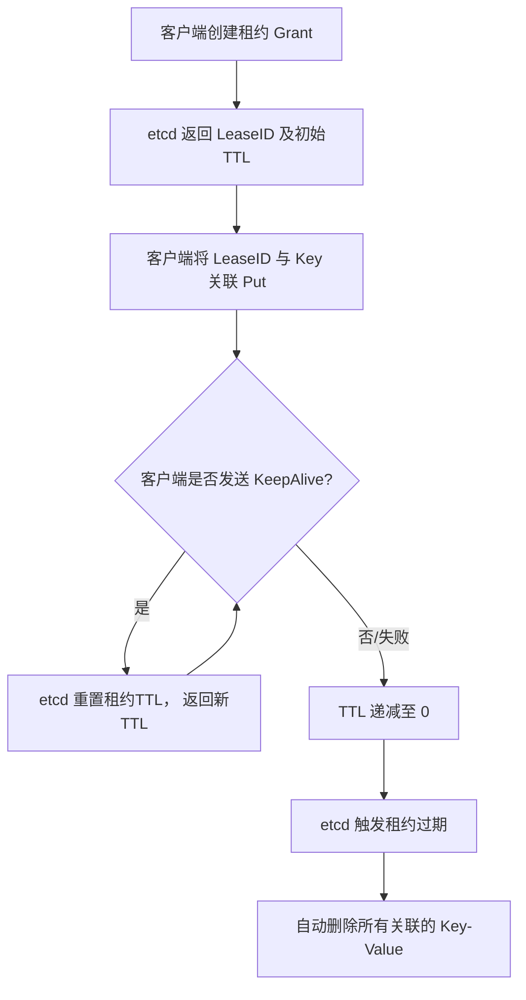

好的，遵照您的要求，为您生成一份关于 etcd Lease（租约）心跳与自动过期的技术文档。

---

# **etcd Lease 租约：心跳与自动过期机制详解**

## **1. 概述**

`Lease` 是 etcd 中一种用于**键值对生命周期管理**的核心机制。它本质上是一个具有**生存时间（TTL）的契约**。客户端可以创建一个租约，并将其与一个或多个键值对关联。etcd 服务器会负责维护这个租约的存活状态（通过心跳），并在租约过期后，**自动删除所有与其关联的键值对**。

**核心价值：**
*   **自动清理**：确保系统中的临时数据或会话状态在客户端异常退出、网络分区等故障发生时能被自动回收，避免数据无限期堆积。
*   **分布式锁/选主基础**：为构建分布式锁、服务注册发现、节点活性探活等高阶功能提供了底层原语。
*   **资源保障**：通过设定 TTL，为系统资源的使用提供了一个时间上限。

## **2. 核心概念**

1.  **租约（Lease）**： 一个由 etcd 服务器生成的唯一 ID（`LeaseID`），附带一个 TTL 值。
2.  **TTL（Time To Live）**： 租约的有效期，单位为秒。从最后一次收到有效心跳开始倒计时。
3.  **心跳（KeepAlive）**： 客户端定期向 etcd 服务器发送的续约请求，用于重置租约的 TTL 计时器，防止其过期。
4.  **关联（Attach）**： 在执行键值对写入（`Put`）操作时，可以指定一个 `LeaseID`，将此键值对绑定到该租约。
5.  **过期（Expire）**： 当租约的 TTL 减少到 0 时，etcd 服务器判定租约过期，触发删除所有关联键的操作。

## **3. 工作流程与心跳机制**

### **3.1 生命周期流程图**



### **3.2 心跳的两种模式**

1.  **主动保活（KeepAlive）**：
    *   客户端需显式地、周期性地调用 `Lease.KeepAlive` API。
    *   该 API 通常会建立一个双向流（gRPC stream），客户端不断发送请求，服务器不断回复当前的 TTL。
    *   **优点**：客户端能实时感知租约状态（通过流响应）。
    *   **缺点**：需要客户端维持额外的逻辑和连接。

2.  **一次性续租（KeepAliveOnce）**：
    *   客户端在需要时（例如，在业务逻辑的某个节点）调用 `Lease.KeepAliveOnce`。
    *   这是一个单向的 RPC 调用，仅重置一次 TTL。
    *   **优点**：简单，无状态，无需维护长连接流。
    *   **缺点**：客户端无法及时感知租约是否已在服务器端过期（例如由于网络问题），易导致“僵尸租约”的误判。

### **3.3 过期时间的计算**

*   租约的 TTL 是一个**服务器端维护的倒计时**。
*   每次收到有效的 `KeepAlive` 请求，该租约的 TTL 会被**重置为创建时指定的初始值**。
*   TTL 的递减由 etcd 服务器后台的**定期检查器**执行，检查间隔通常是几百毫秒量级，因此过期并非完全精确到秒。

## **4. 使用示例（以 etcd v3 API，Go 客户端为例）**

```go
package main

import (
    "context"
    "fmt"
    "log"
    "time"
    clientv3 "go.etcd.io/etcd/client/v3"
)

func main() {
    // 1. 连接 etcd
    cli, err := clientv3.New(clientv3.Config{
        Endpoints:   []string{"localhost:2379"},
        DialTimeout: 5 * time.Second,
    })
    if err != nil {
        log.Fatal(err)
    }
    defer cli.Close()

    ctx := context.Background()
    lease := clientv3.NewLease(cli)

    // 2. 创建一个 TTL 为 10 秒的租约
    grantResp, err := lease.Grant(ctx, 10)
    if err != nil {
        log.Fatal(err)
    }
    leaseId := grantResp.ID
    fmt.Printf("Created lease %x with TTL %d\n", leaseId, grantResp.TTL)

    // 3. 将租约与一个键值对关联
    kv := clientv3.NewKV(cli)
    _, err = kv.Put(ctx, "/server/node1", "alive", clientv3.WithLease(leaseId))
    if err != nil {
        log.Fatal(err)
    }
    fmt.Println("Key '/server/node1' attached to lease")

    // 4. 启动一个独立的 Goroutine 进行自动心跳保活
    // KeepAlive 返回一个 <-chan *clientv3.LeaseKeepAliveResponse
    keepAliveChan, err := lease.KeepAlive(ctx, leaseId)
    if err != nil {
        log.Fatal(err)
    }

    go func() {
        for keepAliveResp := range keepAliveChan {
            if keepAliveResp == nil {
                fmt.Println("Lease keepalive channel closed")
                return
            }
            fmt.Printf("Lease %x keepalived, new TTL: %d\n", keepAliveResp.ID, keepAliveResp.TTL)
        }
    }()

    // 5. 模拟业务运行，并定期检查键是否存在
    for i := 0; i < 20; i++ {
        getResp, err := kv.Get(ctx, "/server/node1")
        if err != nil {
            log.Fatal(err)
        }
        if len(getResp.Kvs) > 0 {
            fmt.Println("Key exists:", string(getResp.Kvs[0].Value))
        } else {
            fmt.Println("Key has been automatically deleted due to lease expiration!")
            break
        }
        time.Sleep(2 * time.Second)
    }

    // 6. （可选）显式撤销租约，会立即删除关联键
    // lease.Revoke(ctx, leaseId)
    // fmt.Println("Lease revoked explicitly")
}
```

**输出预期：**
前10秒左右，键 `/server/node1` 一直存在，并且会打印心跳成功的日志。大约10秒后（如果没有心跳或进程停止），程序会检测到键已被自动删除。

## **5. 最佳实践与注意事项**

1.  **合理设置 TTL**：
    *   TTL 不宜过短，避免频繁的心跳请求给 etcd 服务器和网络带来压力。
    *   TTL 不宜过长，否则在客户端故障时，资源释放会延迟。
    *   通常建议在 10 秒到几分钟之间，根据具体场景调整。

2.  **处理心跳失败**：
    *   `KeepAlive` 返回的 channel 关闭或返回错误，意味着心跳流已中断。客户端应做好错误处理，准备重建租约和关联数据。
    *   使用 `KeepAliveOnce` 时，需要有重试和状态检查机制。

3.  **租约并非完全可靠**：
    *   在网络分区或 etcd 集群严重负载的情况下，心跳可能失败。应用层应有容错设计，不绝对依赖租约过期作为唯一的状态判断依据。

4.  **避免大量租约**：
    *   每个活跃的租约都会消耗 etcd 的内存和 CPU 资源（用于计时和检查）。设计时应避免创建海量（如数十万）的短生命周期租约。

5.  **监控**：
    *   监控 etcd 的 `etcd_server_lease_expired_total` 和 `etcd_server_lease_granted_total` 等指标，了解租约的创建和过期频率。

## **6. 常见问题**

*   **Q：客户端进程崩溃后，租约何时过期？**
    *   A：从最后一次成功心跳开始，经过完整的 TTL 时间后过期。例如 TTL=10秒，崩溃前1秒刚发过心跳，则大约9秒后键被删除。

*   **Q：可以修改已创建租约的 TTL 吗？**
    *   A：不能直接修改。但可以通过持续的 `KeepAlive` 来无限重置它，或者**撤销旧租约并创建一个具有新 TTL 的新租约**，然后将键重新关联到新租约。

*   **Q：一个租约可以关联多少个键？**
    *   A：没有硬性限制，但一个租约关联过多键，在其过期时会导致 etcd 产生一个大的删除事务，可能产生性能峰值。建议合理规划关联关系。

*   **Q：如何知道哪些键关联到了某个租约？**
    *   A：etcd 没有直接的反查 API。通常需要在应用层维护这个映射关系。可以通过查询键的元数据（在 `v3` API 中，`Get` 时带 `WithSerializable()` 和 `clientv3.WithKeysOnly()` 再过滤）进行遍历查找，但效率较低。

## **7. 总结**

etcd 的 Lease 机制通过“心跳维持租约，过期自动清理”的模式，为分布式系统提供了高效、自动的临时数据生命周期管理能力。正确理解和使用心跳与过期机制，是构建基于 etcd 的稳定、可靠应用（如分布式锁、服务发现、配置中心）的关键基石。开发者应结合业务场景，谨慎设置 TTL，并妥善处理心跳异常情况。

---
**文档版本：** 1.0
**最后更新：** 2023年10月27日