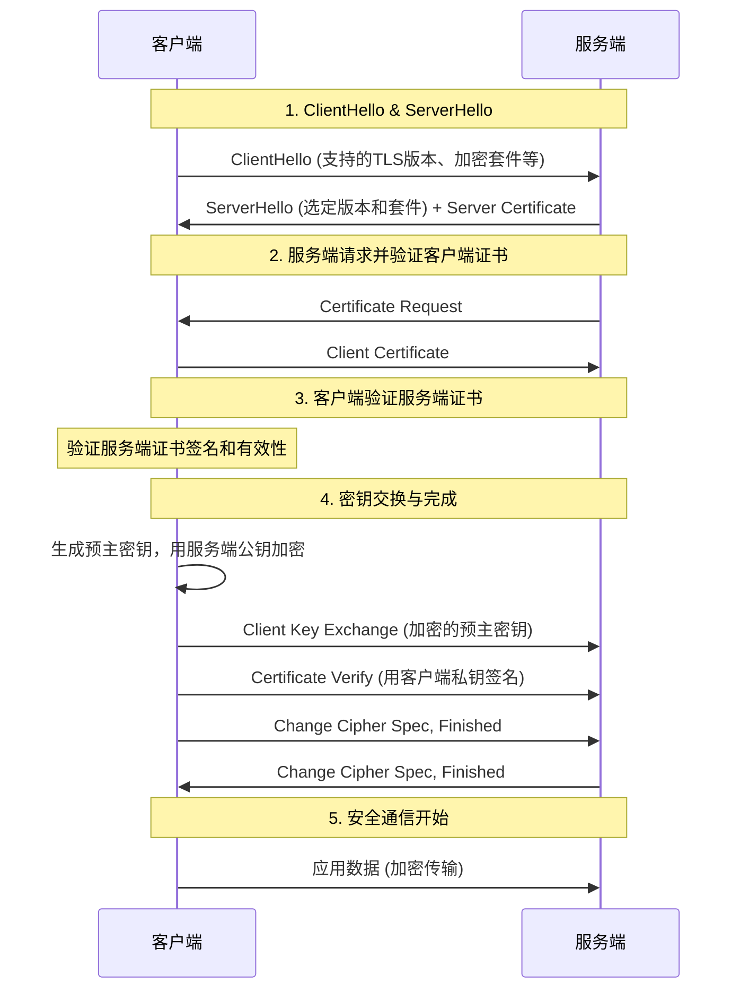

好的，遵照您的指示，我将为您生成一份关于 **mTLS双向认证原理** 的详细技术文档。

---

# **mTLS双向认证技术原理详解**

**文档版本：** 1.0
**发布日期：** 2023年10月27日
**关键词：** TLS/SSL, mTLS, 双向认证, 公钥基础设施, 身份认证, 网络安全

---

## **摘要**

本文档旨在深入阐述**mTLS双向认证** 的核心原理、工作流程及其在保障服务间通信安全中的关键作用。通过对比传统单向TLS，详细解析mTLS的握手过程、证书体系及安全优势，为架构师、开发人员和运维人员提供清晰的技术参考。

## **1. 概述**

### **1.1 什么是TLS/SSL？**
传输层安全协议及其前身安全套接层协议，是用于在两个通信应用程序之间提供保密性和数据完整性的加密协议。它是HTTPS、SMTPS等安全通信的基础。

### **1.2 单向TLS vs. 双向TLS**
*   **单向TLS**：这是最常见的模式（如浏览网页）。仅**客户端**验证**服务端**的证书，确认其身份（例如，确认访问的是 `https://www.example.com` 而非钓鱼网站）。服务端不验证客户端身份，通常使用用户名/密码等其他方式。
*   **双向TLS**：即 **mTLS**。在TLS握手过程中，**不仅客户端验证服务端证书，服务端也要求并验证客户端证书**。只有双方都成功验证了对方的证书后，加密通道才会建立。这是一种基于证书的强身份认证机制。

### **1.3 mTLS的核心价值**
mTLS主要用于**服务到服务** 的通信场景，例如微服务架构、API网关与后端服务、云原生应用内部通信等。它解决了以下问题：
1.  **服务身份认证**：确保通信双方都是可信的、已知的服务，防止中间人攻击和服务器冒用。
2.  **零信任网络** 的基础组件：在零信任模型中，“从不信任，始终验证”，mTLS为每次请求提供了强大的身份凭证。
3.  **替代弱认证方式**：可以替代API密钥、Token等容易被盗用或泄露的认证方式。

## **2. 核心组件与概念**

### **2.1 公钥基础设施**
mTLS的实现依赖于PKI，主要包含以下角色：
*   **证书颁发机构**：受信任的第三方实体，用于签发和验证数字证书。
*   **数字证书**：遵循X.509标准，包含持有者的公钥、身份信息以及CA的数字签名。
*   **公钥与私钥**：非对称加密密钥对。公钥公开，用于加密和验证签名；私钥保密，用于解密和创建签名。
*   **根证书**：CA自身的证书，是信任链的起点，通常预置于操作系统或应用的信任存储中。

### **2.2 证书内容**
一个典型的客户端或服务端证书包含：
*   颁发给谁
*   由谁颁发
*   有效期
*   公钥
*   CA的数字签名

## **3. mTLS握手流程详解**

下图展示了一个简化的mTLS握手过程：

**流程分步解析：**

1.  **ClientHello & ServerHello**：
    *   客户端发起连接，发送支持的TLS版本、加密套件列表和一个随机数。
    *   服务端回应选定的版本和加密套件、一个随机数，并发送自己的**服务端证书链**。

2.  **服务端请求客户端证书**：
    *   服务端发送一个 `CertificateRequest` 消息，表明要求客户端提供证书，并指定其可接受的CA列表。

3.  **客户端验证服务端证书**：
    *   客户端使用本地信任的**根证书**验证服务端证书的签名链，确保证书由可信CA签发、在有效期内且主机名匹配。

4.  **客户端发送证书并验证**：
    *   客户端发送自己的**客户端证书**。
    *   客户端使用其**私钥**对之前所有握手消息的摘要进行签名，并发送 `CertificateVerify` 消息，向服务端证明它确实持有该证书对应的私钥。

5.  **服务端验证客户端证书**：
    *   服务端收到客户端证书后，同样进行验证（签名链、有效期等）。
    *   服务端使用客户端证书中的**公钥**解密 `CertificateVerify` 中的签名，并与握手消息摘要比对。如果一致，则证明客户端身份真实可信。

6.  **密钥交换与完成**：
    *   客户端生成**预主密钥**，用服务端证书中的公钥加密后发送给服务端。
    *   双方使用交换的随机数和预主密钥，独立生成相同的**会话密钥**。
    *   双方发送 `Finished` 消息，用会话密钥加密，验证整个握手过程未被篡改。

7.  **安全通信**：
    *   握手完成，双方使用对称加密的会话密钥进行高效的加密通信。

## **4. 关键安全特性**

*   **双向身份认证**：通过证书验证，双方身份都得到强保证。
*   **机密性**：使用协商出的会话密钥对应用层数据进行对称加密。
*   **完整性**：使用消息认证码防止数据在传输中被篡改。
*   **前向安全性**：如果使用ECDHE等密钥交换算法，即使服务器私钥未来泄露，过去的通信记录也无法被解密。

## **5. 典型应用场景**

1.  **微服务架构**：确保服务网格内所有Pod/服务之间的通信安全。
2.  **API安全**：保护企业内部的API或对外开放的敏感API，替代API密钥。
3.  **零信任网络访问**：对用户或设备访问内部应用进行强身份认证。
4.  **物联网**：设备与云平台之间的安全认证与通信。

## **6. 实施与挑战**

### **6.1 实施要点**
*   **私有CA**：企业内通常使用私有CA（如`CFSSL`, `Vault`, 私有云托管服务）来签发和管理内部服务的证书。
*   **证书生命周期管理**：包括自动化签发、部署、轮换和吊销。这是实施mTLS最大的运维挑战。
*   **服务网格**：像Istio、Linkerd这样的服务网格，通常将mTLS作为核心功能，透明地注入和管理证书，简化了应用层的复杂性。

### **6.2 挑战**
*   **复杂性**：PKI体系的搭建和管理有一定复杂度。
*   **运维开销**：证书的自动轮换和吊销机制需要精心设计。
*   **故障排查**：证书错误（如过期、主机名不匹配、信任链断裂）会导致连接失败，排查需要专业知识。

## **7. 总结**

mTLS双向认证通过利用PKI和TLS协议，为服务间通信提供了业界标准的、强大的身份认证和传输安全保障。它是构建安全、可信的现代分布式系统，特别是零信任架构的基石。尽管在证书管理方面存在挑战，但随着自动化工具和服务网格的成熟，其采用正变得越来越广泛和便捷。

**附录：**
*   **RFC 5246**: The Transport Layer Security (TLS) Protocol Version 1.2
*   **OpenSSL**: 常用的TLS工具包和命令行工具。
*   **服务网格文档**：如Istio Security。

---