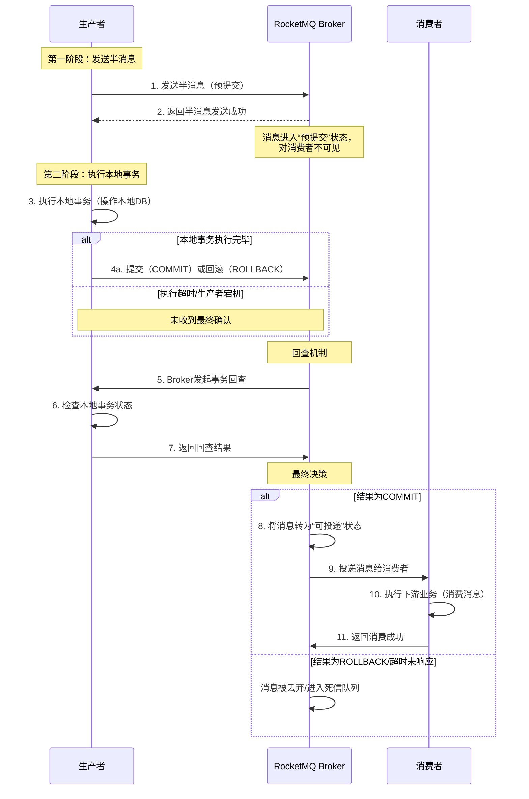

好的，遵照您的要求，为您生成一份关于“事务消息（RocketMQ半消息+回查）方案”的技术文档。

---

# **分布式事务消息解决方案：RocketMQ半消息与事务状态回查**

**文档版本：** 1.0
**最后更新：** 2023-10-27
**摘要：** 本文档详细阐述了在高并发、分布式系统中，如何利用Apache RocketMQ提供的“事务消息”（基于“半消息”和“事务状态回查”机制）来保障核心业务操作与下游依赖操作之间的最终一致性。

---

## 1. 概述

### 1.1 背景
在微服务架构下，一个业务操作往往涉及多个服务和数据库的更新。例如，用户下单时，需要：
1.  在**订单服务**创建订单（操作本地数据库）。
2.  调用**积分服务**为用户增加积分（操作另一个数据库）。

如何保证这两个操作要么同时成功，要么同时失败（即数据一致性），是典型的分布式事务问题。

### 1.2 传统方案的痛点
*   **本地消息表：** 侵入业务，需要设计和维护额外的消息表。
*   **XA/2PC：** 强一致性方案，但性能差，资源锁定时间长，不适用于高并发场景。
*   **TCC：** 代码侵入性强，业务逻辑复杂，开发成本高。

### 1.3 RocketMQ事务消息方案的价值
RocketMQ事务消息提供了一种**最终一致性**的解决方案，其核心思想是：**先将消息投递到MQ，再执行本地事务，最后根据本地事务执行结果决定消息的最终投递与否**。它较好地平衡了一致性、性能和开发复杂度。

## 2. 核心概念

### 2.1 半消息（Half Message / Prepared Message）
*   **定义：** 一种对消费者**不可见**的临时状态消息。生产者已成功发送到Broker，但Broker不会立即将其投递给消费者。
*   **目的：** 作为“预提交”的凭证，确保本地事务执行前，消息已可靠存储。

### 2.2 本地事务状态（Local Transaction State）
生产者执行与消息关联的本地业务逻辑（如操作本地数据库）后产生的结果。主要有两种：
*   **`LocalTransactionState.COMMIT_MESSAGE`：** 本地事务执行成功，允许消息被消费。
*   **`LocalTransactionState.ROLLBACK_MESSAGE`：** 本地事务执行失败，消息将被丢弃。
*   **`LocalTransactionState.UNKNOW`：** 本地事务状态未知（如网络超时），需要等待后续的**事务状态回查**。

### 2.3 事务状态回查（Transaction Check）
*   **触发条件：** 当生产者向Broker返回`UNKNOW`状态，或生产者因宕机、网络异常等原因未返回最终状态时。
*   **执行者：** RocketMQ Broker会定期（可配置）向消息生产者发起回查。
*   **目的：** 查询该半消息对应的本地事务的最终结果（成功或失败），并据此完成消息的提交或回滚。

## 3. 工作原理与流程

RocketMQ事务消息是一个**两阶段提交（2PC）** 的变种实现。



**详细步骤解析：**

1.  **发送半消息：** 生产者向Broker发送一条“半消息”。此消息存储在特定的`RMQ_SYS_TRANS_HALF_TOPIC`主题下，对普通消费者不可见。
2.  **执行本地事务：** 半消息发送成功后，生产者执行关联的本地事务（例如：在订单数据库插入一条记录）。
3.  **提交或回滚：**
    *   若本地事务执行成功，生产者向Broker发送`COMMIT`指令。
    *   若本地事务执行失败，生产者向Broker发送`ROLLBACK`指令。
    *   若生产者发生异常（如宕机、网络中断），未能发送最终指令，则进入**回查流程**。
4.  **事务状态回查：** Broker会定期扫描处于“半消息”状态的消息，并向其生产者发起回查请求。
5.  **响应回查：** 生产者收到回查请求后，需检查该消息对应的本地事务的最终结果（例如：查询本地数据库中该订单是否存在），并向Broker返回`COMMIT`或`ROLLBACK`。
6.  **最终投递或丢弃：**
    *   若最终结果为`COMMIT`，Broker将该半消息从`RMQ_SYS_TRANS_HALF_TOPIC`转移到原始目标Topic，变为可被消费者消费的普通消息。
    *   若最终结果为`ROLLBACK`或多次回查无响应，Broker会直接丢弃或将该消息移入死信队列（DLQ）。

## 4. 技术实现（Java示例）

### 4.1 生产者配置与实现
```java
import org.apache.rocketmq.client.producer.*;
import org.apache.rocketmq.common.message.Message;
import org.apache.rocketmq.common.message.MessageExt;

public class TransactionalProducer {
    public static void main(String[] args) throws Exception {
        // 1. 创建事务生产者
        TransactionMQProducer producer = new TransactionMQProducer("please_rename_unique_group_name");
        producer.setNamesrvAddr("localhost:9876");

        // 2. 设置事务监听器（核心）
        producer.setTransactionListener(new TransactionListener() {
            /**
             * 执行本地事务
             * @param msg 半消息
             * @param arg 调用sendMessageInTransaction时传入的业务参数
             * @return 本地事务状态
             */
            @Override
            public LocalTransactionState executeLocalTransaction(Message msg, Object arg) {
                // 业务逻辑：操作本地数据库
                try {
                    // 示例：将订单信息插入本地数据库
                    // orderService.createOrder((OrderDTO)arg);
                    System.out.println("执行本地事务：" + msg.getTransactionId());
                    // 模拟业务成功
                    return LocalTransactionState.COMMIT_MESSAGE; // 成功
                    // return LocalTransactionState.ROLLBACK_MESSAGE; // 失败
                    // return LocalTransactionState.UNKNOW; // 未知，触发回查
                } catch (Exception e) {
                    // 业务失败，回滚
                    return LocalTransactionState.ROLLBACK_MESSAGE;
                }
            }

            /**
             * 事务回查
             * @param msg 需要回查的半消息
             * @return 本地事务状态
             */
            @Override
            public LocalTransactionState checkLocalTransaction(MessageExt msg) {
                // 业务逻辑：根据消息KEY（如订单ID）查询本地事务结果
                String orderId = msg.getKeys();
                // 示例：查询订单是否存在
                // Order order = orderService.queryOrderById(orderId);
                System.out.println("执行事务回查：" + msg.getTransactionId());
                
                // 模拟查询结果
                if (/*order != null*/ true) {
                    return LocalTransactionState.COMMIT_MESSAGE;
                } else {
                    return LocalTransactionState.ROLLBACK_MESSAGE;
                }
            }
        });

        producer.start();

        // 3. 发送事务消息
        for (int i = 0; i < 5; i++) {
            Message msg = new Message("TransactionTopic", "TagA", ("Hello RocketMQ " + i).getBytes());
            // 设置业务KEY，用于回查时定位业务数据
            msg.setKeys("ORDER_ID_" + i);
            // 第二个参数（arg）会传递给 executeLocalTransaction 方法
            TransactionSendResult sendResult = producer.sendMessageInTransaction(msg, null);
            System.out.println("发送结果：" + sendResult);
        }

        // 4. 保持生产者运行，等待可能的回查请求
        Thread.sleep(60000);
        producer.shutdown();
    }
}
```

### 4.2 消费者实现
消费者的实现与普通消息消费者**完全一致**，无需关心事务逻辑。
```java
// 标准消费者，只需订阅对应Topic即可消费到已提交的事务消息。
```

## 5. 典型应用场景

1.  **电商订单与积分/优惠券：** 下单成功，异步发放积分、核销优惠券。
2.  **支付与账务/通知：** 支付成功，异步更新账户余额、发送支付成功短信/邮件。
3.  **主数据变更与数据同步：** 用户中心更新用户信息，异步同步到搜索索引、风控系统等。
4.  **异步解耦的最终一致性系统：** 任何需要将核心事务与后续异步操作解耦，并保证最终一致性的场景。

## 6. 方案的优点与局限性

### 6.1 优点
*   **解耦与异步：** 核心业务与下游依赖操作解耦，提升主流程响应速度。
*   **最终一致性保障：** 通过可靠的半消息存储和回查机制，最大程度保证数据一致性。
*   **对消费者透明：** 消费者以普通消息方式消费，无需感知上游事务。
*   **性能较好：** 相比XA等强一致性方案，对资源锁定时间短。

### 6.2 局限性与注意事项
*   **最终一致性：** 不保证实时强一致性，存在短暂的数据延迟。
*   **生产者端复杂性：** 需要实现`TransactionListener`，处理好本地事务和回查逻辑。
*   **消息可能被重复消费：** 在`COMMIT`成功但Broker未收到确认等极端情况下，消息可能被重复投递。**消费者必须实现幂等性**。
*   **回查逻辑设计：** `checkLocalTransaction`方法必须保证幂等和高效，因为它可能被多次调用。
*   **网络与超时：** 需要合理配置`transactionTimeout`等参数，以适应业务执行时间。

## 7. 总结

RocketMQ事务消息（半消息+回查）方案是一种在分布式系统中实现**跨服务最终一致性**的高效、可靠且成熟的解决方案。它将复杂的分布式事务问题，通过消息中间件巧妙地转换为**本地事务 + 可靠消息投递**的问题，极大地降低了开发复杂度和系统耦合度。

在采用此方案时，团队应充分理解其**最终一致性**本质，并在生产者端确保本地事务与消息发送的原子性，在消费者端务必实现**幂等消费**，以构建健壮的分布式应用。

--- 
*本技术文档仅供参考，实际生产环境中请根据具体业务需求和RocketMQ版本进行调整、测试和验证。*