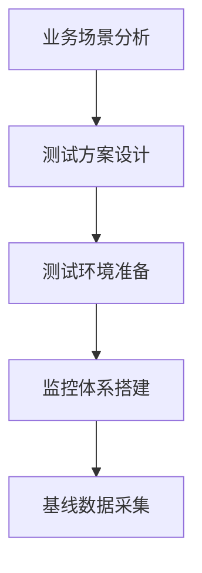

# 压测方法论（梯度加压/稳定性测试/峰值测试）

## 1. 概述
性能压测是通过模拟真实用户并发访问系统，验证系统在特定负载下的性能表现、稳定性和扩展能力的技术手段。科学的压测方法能够发现系统瓶颈、验证容量规划、预防生产环境故障。

## 2. 核心压测方法

### 2.1 梯度加压测试
#### 概念
采用渐进式增加并发用户数的方式，逐步探测系统在不同压力层级下的性能表现，绘制系统性能变化曲线。

#### 实施步骤
1. **基准测试**：低并发(10-50用户)验证基础功能
2. **逐步加压**：按梯度(如50→100→200→500→1000用户)增加并发
3. **性能监控**：每个梯度稳定运行5-10分钟
4. **数据分析**：记录TPS、响应时间、错误率变化曲线
5. **拐点识别**：发现性能明显下降的临界点

#### 关键指标
```
加压阶段：并发用户数从50逐步增加到1000
关注指标：
- TPS(每秒事务数)变化趋势
- 平均响应时间增长曲线
- 错误率突变点(通常应<0.1%)
- 系统资源(CPU/内存/IO)利用率
```

#### 适用场景
- 系统容量评估
- 性能瓶颈定位
- 扩容阈值确定

### 2.2 稳定性测试
#### 概念
在特定压力水平下持续运行较长时间(通常4-24小时)，验证系统在长时间运行中是否存在内存泄漏、性能衰减等稳定性问题。

#### 实施要点
1. **压力设定**：选择日常峰值的80%压力水平
2. **持续时间**：至少4小时，建议8-24小时
3. **监控重点**：
   - 内存使用趋势(是否有持续增长)
   - 线程/连接数是否稳定
   - 垃圾回收频率和时间
   - 系统资源随时间变化趋势

4. **检查项**：
   - 是否有内存泄漏(OOM风险)
   - 性能是否随时间衰减
   - 中间件连接池是否稳定
   - 数据库连接/锁等待情况

#### 成功标准
- 错误率保持在可接受范围内(通常<0.1%)
- 性能指标无明显衰减趋势
- 系统资源使用平稳，无持续增长
- 无内存泄漏或资源耗尽

### 2.3 峰值测试
#### 概念
模拟系统可能遇到的最高并发场景，验证系统在极限压力下的表现和容错能力。

#### 实施策略
1. **压力目标确定**：
   - 历史峰值×120%
   - 业务预估最大容量
   - 竞争对手对标压力

2. **测试模式**：
   - **突发模式**：瞬间达到峰值压力
   - **斜坡模式**：快速爬升至峰值
   - **混合模式**：不同业务模块按比例施压

3. **重点关注**：
   - 系统极限处理能力
   - 降级熔断机制是否生效
   - 失败后的恢复能力
   - 监控告警是否及时

4. **灾难场景验证**：
   - 单节点故障下的系统表现
   - 依赖服务宕机时的容错
   - 网络延迟激增的影响

## 3. 综合实施流程

### 3.1 压测准备阶段


### 3.2 测试执行策略
```
阶段1：梯度测试(2-3小时)
  目的：确定最佳压力点和瓶颈

阶段2：稳定性测试(8-12小时)  
  目的：验证长时间运行可靠性

阶段3：峰值测试(1-2小时)
  目的：验证极限和容错能力

阶段4：恢复测试(0.5小时)
  目的：验证压力解除后系统恢复
```

### 3.3 监控体系
#### 必备监控项
1. **应用层**：TPS、响应时间(P50/P90/P99)、错误率
2. **系统层**：CPU、内存、磁盘IO、网络带宽
3. **中间件**：数据库连接数、缓存命中率、MQ堆积
4. **业务层**：核心业务成功率、关键接口性能

## 4. 结果分析与优化

### 4.1 性能瓶颈识别
| 现象 | 可能原因 | 验证方法 |
|------|---------|---------|
| CPU持续高位 | 代码效率低、线程过多 | 线程dump分析 |
| 内存持续增长 | 内存泄漏、缓存不当 | 堆内存分析 |
| 响应时间突增 | 数据库慢查询、外部依赖超时 | SQL分析、链跟踪 |
| TPS上不去 | 配置限制、锁竞争 | 配置检查、代码审查 |

### 4.2 优化建议
1. **应用层优化**
   - 代码性能优化(算法、SQL)
   - 缓存策略优化
   - 异步处理非核心逻辑

2. **架构层优化**
   - 水平扩展设计
   - 读写分离
   - 服务降级方案

3. **基础设施优化**
   - JVM参数调优
   - 数据库索引优化
   - 网络配置优化

## 5. 风险控制与最佳实践

### 5.1 风险控制
1. **环境隔离**：压测环境与生产环境隔离
2. **数据安全**：使用脱敏数据或压测专用数据
3. **熔断机制**：设置明确的停止条件(错误率>5%)
4. **应急预案**：准备压测异常处理流程

### 5.2 最佳实践
1. **常态化压测**：建立定期压测机制
2. **真实场景**：模拟真实用户行为模式
3. **全链路压测**：覆盖完整业务链路
4. **自动化执行**：建立自动化压测流水线
5. **持续优化**：根据压测结果持续改进

## 6. 报告输出模板

### 压测报告结构
```
1. 执行概要
2. 测试环境与配置
3. 测试场景与策略
4. 性能数据分析
5. 瓶颈问题与根因
6. 优化建议与方案
7. 风险评估与改进计划
8. 附件(详细数据、监控截图)
```

## 7. 工具推荐
1. **压测工具**：JMeter、Gatling、Locust、nGrinder
2. **监控工具**：Prometheus+Grafana、SkyWalking、Arthas
3. **分析工具**：火焰图生成工具、JProfiler、MAT

---

通过科学的压测方法论，结合梯度加压、稳定性测试和峰值测试三种核心方法，能够全面评估系统性能，提前发现潜在问题，为系统稳定运行提供有力保障。建议将性能压测纳入日常研发流程，建立性能基线和持续改进机制。