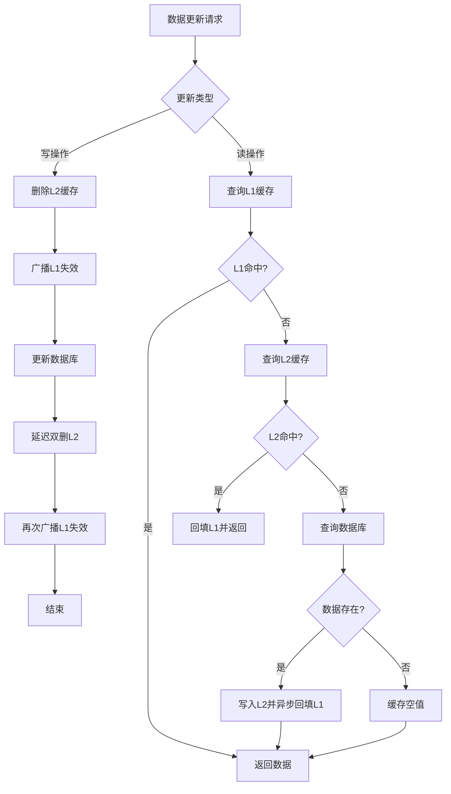

# 多级缓存(L1 Caffeine + L2 Redis)一致性维护技术文档

## 1. 概述

### 1.1 背景与定义
多级缓存架构是现代高并发系统中的常见设计模式，通过在不同层级（本地/分布式）部署缓存，兼顾访问速度与数据共享需求。本方案采用两级缓存设计：
- **L1 缓存**：本地缓存，使用Caffeine实现，提供纳秒级访问速度
- **L2 缓存**：分布式缓存，使用Redis实现，保证集群内数据一致

### 1.2 架构图示
```
┌─────────┐     ┌─────────┐     ┌─────────┐
│ 应用层  │────▶│ L1缓存  │────▶│ L2缓存  │────▶│ 数据库  │
│ (业务)  │◀────│ (本地)  │◀────│ (Redis) │◀────│ (源)   │
└─────────┘     └─────────┘     └─────────┘     └─────────┘
  读写请求        Caffeine        集群共享       MySQL/等
```

## 2. 一致性挑战分析

### 2.1 核心问题
多级缓存架构面临的一致性难题主要源于：

#### 2.1.1 缓存穿透问题
- 数据在某一级缓存失效，但其他层级仍有效
- 并发请求下可能引发"先删缓存后更新DB"或"先更新DB后删缓存"的时序竞争

#### 2.1.2 并发更新竞态
```
时序问题示例：
1. 线程A：删除L2缓存
2. 线程B：读取数据（L1/L2均无）→ 从DB加载旧值
3. 线程A：更新DB新值
4. 线程B：将旧值写入L1和L2
结果：缓存中存储了过时的旧数据
```

#### 2.1.3 缓存失效风暴
- 热点数据同时失效导致大量请求穿透到数据库
- 本地缓存独立失效，集群节点间数据不一致

## 3. 一致性维护方案

### 3.1 核心设计原则

#### 原则1：缓存作为只读副本
- 数据以数据库为唯一可信源
- 缓存数据均为副本，允许短期不一致

#### 原则2：失效而非更新
- 缓存数据变更时采用删除策略
- 避免复杂的并发更新逻辑

#### 原则3：异步最终一致
- 接受毫秒级短暂不一致
- 通过异步机制保证最终一致性

### 3.2 读写策略设计

#### 3.2.1 读流程（Cache-Aside Pattern增强版）
```java
public Data read(String key) {
    // 1. 先读L1缓存
    Data data = caffeine.get(key);
    if (data != null) {
        return data;
    }
    
    // 2. 尝试获取分布式锁，防止缓存击穿
    if (tryLock(key)) {
        try {
            // 3. 再次检查L1（双重检查锁模式）
            data = caffeine.get(key);
            if (data != null) {
                return data;
            }
            
            // 4. 读取L2缓存
            data = redis.get(key);
            if (data != null) {
                // 4.1 回填L1缓存，设置合理TTL
                caffeine.put(key, data, ttl);
                return data;
            }
            
            // 5. 查询数据库
            data = db.query(key);
            if (data != null) {
                // 5.1 同步写入L2（设置较长的TTL）
                redis.setex(key, ttl_long, data);
                // 5.2 异步回填L1
                asyncFillL1(key, data);
            } else {
                // 5.3 缓存空值，防止缓存穿透
                cacheNullValue(key);
            }
            
            return data;
        } finally {
            releaseLock(key);
        }
    } else {
        // 6. 未获取到锁，短暂等待后重试或返回降级数据
        return waitOrDegrade(key);
    }
}
```

#### 3.2.2 写流程（双删策略 + 异步失效）
```java
public void update(String key, Data newData) {
    // 阶段1：先删除缓存，再更新数据库
    // 1.1 删除L2缓存（同步）
    redis.delete(key);
    
    // 1.2 发布L1失效消息（异步）
    publishL1Invalidation(key);
    
    // 1.3 更新数据库
    db.update(key, newData);
    
    // 阶段2：延迟二次删除（处理并发读导致的旧数据回填）
    schedule(() -> {
        // 2.1 延迟后再次删除L2
        redis.delete(key);
        
        // 2.2 再次发布L1失效
        publishL1Invalidation(key);
        
        // 2.3 可选：异步预热最新数据到L2
        asyncWarmUp(key);
    }, delayTime); // 通常延迟500ms-1s
}
```

### 3.3 L1缓存同步机制

#### 3.3.1 基于消息队列的失效广播
```
组件设计：
- 发布者：数据变更时发送失效消息
- 消息通道：Redis Pub/Sub或Kafka
- 订阅者：各应用节点监听并清理本地缓存
```

#### 3.3.2 消息格式设计
```json
{
  "type": "invalidate", // 操作类型
  "keys": ["key1", "key2"], // 失效键列表
  "timestamp": 1633046400000, // 消息时间戳
  "source": "service-a", // 来源服务
  "version": "v1" // 协议版本
}
```

#### 3.3.3 本地缓存清理策略
```java
// 消息监听器实现
@EventListener
public void handleInvalidation(CacheInvalidationEvent event) {
    for (String key : event.getKeys()) {
        // 1. 立即失效指定key
        caffeine.invalidate(key);
        
        // 2. 对于通配符模式，遍历匹配的key
        if (key.contains("*")) {
            caffeine.invalidateMatching(pattern);
        }
        
        // 3. 记录失效日志（用于监控）
        logInvalidation(key, event.getSource());
    }
}
```

### 3.4 流程图：缓存更新与失效流程



## 4. 关键实现细节

### 4.1 缓存键设计规范
```java
public class CacheKeyBuilder {
    // 统一键格式：业务:版本:实体:ID[:后缀]
    public static String build(String business, String version, 
                              String entity, Object id, String suffix) {
        return String.format("%s:%s:%s:%s%s",
            business,
            version,
            entity,
            id.toString(),
            suffix != null ? ":" + suffix : "");
    }
    
    // 示例：用户服务v1版，用户ID=123的详情
    // key = "user:v1:detail:123"
}
```

### 4.2 Caffeine配置策略
```java
@Configuration
public class CaffeineConfig {
    
    @Bean
    public Cache<String, Object> localCache() {
        return Caffeine.newBuilder()
            // 基于权重的最大容量（权重计算器自定义）
            .maximumWeight(10000)
            .weigher((key, value) -> calculateWeight(value))
            
            // 写入后过期时间（短TTL保证最终一致）
            .expireAfterWrite(30, TimeUnit.SECONDS)
            
            // 访问后刷新时间（热数据续期）
            .refreshAfterWrite(10, TimeUnit.SECONDS)
            
            // 弱引用，便于GC回收
            .weakKeys()
            .weakValues()
            
            // 统计信息收集
            .recordStats()
            
            .build();
    }
    
    // 异步刷新加载器
    private AsyncCacheLoader<String, Object> refreshLoader = 
        (key, oldValue, executor) -> 
            CompletableFuture.supplyAsync(() -> {
                // 从Redis或DB重新加载
                return reloadData(key);
            }, executor);
}
```

### 4.3 Redis配置与优化

#### 4.3.1 连接池配置
```yaml
redis:
  pool:
    max-active: 50
    max-idle: 20
    min-idle: 5
    max-wait: 3000ms
  timeout: 2000ms
  cluster:
    nodes: ${REDIS_NODES}
```

#### 4.3.2 Lua脚本保证原子性
```lua
-- 原子化的"获取-设置"操作
local value = redis.call('GET', KEYS[1])
if not value then
    value = load_from_db(KEYS[1])
    redis.call('SETEX', KEYS[1], ARGV[1], value)
end
return value
```

### 4.4 分布式锁实现
```java
public class CacheLockManager {
    
    private static final String LOCK_PREFIX = "lock:cache:";
    private static final int LOCK_TIMEOUT = 3000; // 3秒
    
    public boolean tryLock(String key) {
        String lockKey = LOCK_PREFIX + key;
        String requestId = UUID.randomUUID().toString();
        
        // 使用SET NX EX保证原子性
        Boolean success = redisTemplate.execute(
            (RedisCallback<Boolean>) connection -> 
                connection.set(
                    lockKey.getBytes(),
                    requestId.getBytes(),
                    Expiration.milliseconds(LOCK_TIMEOUT),
                    RedisStringCommands.SetOption.SET_IF_ABSENT
                )
        );
        
        if (Boolean.TRUE.equals(success)) {
            // 锁续期机制
            scheduleLockRenewal(lockKey, requestId);
            return true;
        }
        return false;
    }
    
    public void releaseLock(String key) {
        // 使用Lua脚本保证原子性的"获取-删除"
        String script = 
            "if redis.call('get', KEYS[1]) == ARGV[1] then " +
            "   return redis.call('del', KEYS[1]) " +
            "else " +
            "   return 0 " +
            "end";
        
        redisTemplate.execute(
            new DefaultRedisScript<>(script, Long.class),
            Collections.singletonList(LOCK_PREFIX + key),
            getCurrentRequestId()
        );
    }
}
```

## 5. 监控与运维

### 5.1 监控指标
| 指标类别 | 具体指标 | 告警阈值 | 说明 |
|---------|---------|---------|------|
| 命中率 | L1命中率 | < 70% | 反映本地缓存效果 |
| 命中率 | L2命中率 | < 85% | 反映Redis缓存效果 |
| 响应时间 | L1读取P99 | > 1ms | 本地缓存性能 |
| 响应时间 | L2读取P99 | > 10ms | Redis网络性能 |
| 错误率 | 缓存操作错误率 | > 0.1% | 系统稳定性 |
| 内存使用 | Caffeine使用率 | > 80% | 本地内存压力 |
| 网络开销 | 失效消息量 | 突增50% | 可能存在问题 |

### 5.2 日志记录
```java
@Slf4j
@Component
public class CacheLogger {
    
    // 关键操作日志
    public void logCacheEvent(String event, String key, 
                             long duration, boolean success) {
        log.info("cache_event: {}, key: {}, duration: {}ms, success: {}",
            event, key, duration, success);
        
        // 发送到监控系统
        metrics.record(event, key, duration, success);
    }
    
    // 不一致检测
    public void logInconsistency(String key, Object dbValue, 
                                Object cacheValue) {
        log.warn("cache_inconsistency: {}, db: {}, cache: {}",
            key, dbValue, cacheValue);
        
        // 触发告警
        alertService.notify("缓存不一致", key);
    }
}
```

### 5.3 运维操作

#### 5.3.1 缓存预热脚本
```bash
#!/bin/bash
# 缓存预热脚本
function warmup_cache() {
    local KEY_PATTERN=$1
    local BATCH_SIZE=100
    
    # 从数据库获取需要预热的数据
    DATA_LIST=$(mysql -e "SELECT id FROM table WHERE condition")
    
    # 分批预热
    echo $DATA_LIST | xargs -n $BATCH_SIZE | while read batch; do
        parallel -j 10 curl -X POST "http://service/cache/warmup" \
                 -d "keys=${batch}" ::: 
        sleep 0.1 # 避免压力过大
    done
}
```

#### 5.3.2 缓存清理工具
```java
// 批量清理工具类
public class CacheCleaner {
    
    public int cleanByPattern(String pattern) {
        // 1. 清理Redis
        Set<String> keys = redis.keys(pattern);
        int redisCount = keys.size();
        redis.delete(keys.toArray(new String[0]));
        
        // 2. 广播清理所有节点的本地缓存
        invalidationPublisher.publish(pattern);
        
        // 3. 异步清理本节点
        caffeine.invalidateMatching(pattern);
        
        return redisCount;
    }
}
```

## 6. 容错与降级策略

### 6.1 故障场景处理

#### 场景1：Redis不可用
- **降级策略**：直连数据库，跳过缓存层
- **恢复策略**：渐进式恢复，先恢复读再恢复写
- **监控点**：Redis连接错误率 > 5%

#### 场景2：网络分区
- **处理策略**：本地缓存独立服务，接受数据不一致
- **恢复同步**：网络恢复后增量同步差异数据
- **监控点**：集群节点状态不一致

#### 场景3：消息队列积压
- **处理策略**：批量合并失效消息
- **应急方案**：强制全量刷新受影响缓存域
- **监控点**：消息延迟 > 10秒

### 6.2 服务降级配置
```yaml
resilience4j:
  circuitbreaker:
    cache-service:
      slidingWindowSize: 10
      failureRateThreshold: 50
      waitDurationInOpenState: 30s
      
  fallback:
    cache-read:
      enabled: true
      default-value: "{}"  # 返回空数据而非异常
      
  bulkhead:
    cache-pool:
      maxConcurrentCalls: 100
      maxWaitDuration: 10ms
```

## 7. 性能优化建议

### 7.1 配置调优参数
| 参数 | 推荐值 | 调整依据 |
|------|--------|----------|
| Caffeine最大大小 | 10,000条目 | 基于JVM堆内存的10% |
| L1缓存TTL | 30秒 | 业务容忍不一致时间 |
| L2缓存TTL | 10分钟 | 减少DB压力 |
| 延迟双删时间 | 500ms | 网络往返时间×2 |
| 批量失效大小 | 50条/批 | 减少消息数量 |

### 7.2 热点数据特殊处理
```java
// 热点数据识别与优化
public class HotspotHandler {
    
    // 1. 监控热点key
    @Scheduled(fixedDelay = 60000)
    public void detectHotspots() {
        Map<String, Long> accessStats = caffeine.stats();
        accessStats.entrySet().stream()
            .filter(e -> e.getValue() > 1000) // 每分钟超过1000次
            .forEach(e -> markAsHotspot(e.getKey()));
    }
    
    // 2. 热点数据特殊缓存策略
    public Data getWithHotspotProtection(String key) {
        if (isHotspot(key)) {
            // 更短的TTL，更高的刷新频率
            return cache.get(key, k -> loadData(k), 
                Duration.ofSeconds(10), // 短TTL
                Duration.ofSeconds(5)); // 频繁刷新
        }
        return normalGet(key);
    }
}
```

## 8. 测试方案

### 8.1 一致性测试用例
```java
@Test
public void testCacheConsistency() {
    // 1. 初始状态
    String key = "test:1";
    Data original = saveToDb(key, "value1");
    
    // 2. 并发读写测试
    ExecutorService executor = Executors.newFixedThreadPool(10);
    List<Future<?>> futures = new ArrayList<>();
    
    for (int i = 0; i < 5; i++) {
        futures.add(executor.submit(() -> {
            // 并发读
            cacheService.read(key);
        }));
    }
    
    for (int i = 0; i < 5; i++) {
        futures.add(executor.submit(() -> {
            // 并发写
            cacheService.update(key, "value2");
        }));
    }
    
    // 等待所有操作完成
    futures.forEach(f -> {
        try { f.get(); } catch (Exception e) { /* ignore */ }
    });
    
    // 3. 验证最终一致性
    await().atMost(5, TimeUnit.SECONDS)
           .until(() -> {
               Data cached = cacheService.read(key);
               Data fromDb = dbService.read(key);
               return cached.equals(fromDb);
           });
}
```

### 8.2 性能基准测试
```java
@Benchmark
@BenchmarkMode(Mode.Throughput)
@OutputTimeUnit(TimeUnit.SECONDS)
public void multilevelCacheBenchmark() {
    // 1. 纯DB读取基准
    dbReadBenchmark();
    
    // 2. L2缓存读取基准  
    l2CacheBenchmark();
    
    // 3. L1命中场景基准
    l1HitBenchmark();
    
    // 4. 缓存穿透场景基准
    cacheMissBenchmark();
    
    // 5. 并发更新场景基准
    concurrentUpdateBenchmark();
}
```

## 9. 总结与最佳实践

### 9.1 实施建议
1. **渐进式实施**：先实现L2缓存，稳定后再引入L1缓存
2. **监控先行**：在改造前建立完善的监控体系
3. **业务分级**：根据业务重要性制定不同的缓存策略
4. **容量规划**：基于访问模式和资源约束合理设计缓存大小

### 9.2 常见陷阱与规避
- **陷阱1**：过度依赖缓存导致雪崩
  - **规避**：设置合理的TTL和过期抖动
- **陷阱2**：缓存键设计不当导致内存浪费
  - **规避**：统一键规范，定期清理无效键
- **陷阱3**：忽略网络分区下的数据一致
  - **规避**：设计分区容忍的降级方案
- **陷阱4**：缓存层间TTL设置不合理
  - **规避**：遵循 L1-TTL < L2-TTL 原则

### 9.3 未来演进方向
1. **智能预测预热**：基于机器学习预测热点数据
2. **动态策略调整**：根据负载自动调整缓存参数
3. **跨区域同步**：支持多地域部署的缓存同步
4. **生态集成**：与Service Mesh、云原生技术深度集成

---

**文档版本**：v1.2  
**最后更新**：2024年1月  
**维护团队**：架构组 - 中间件团队  
**相关文档**：《缓存设计规范》、《Redis运维指南》、《性能测试报告》