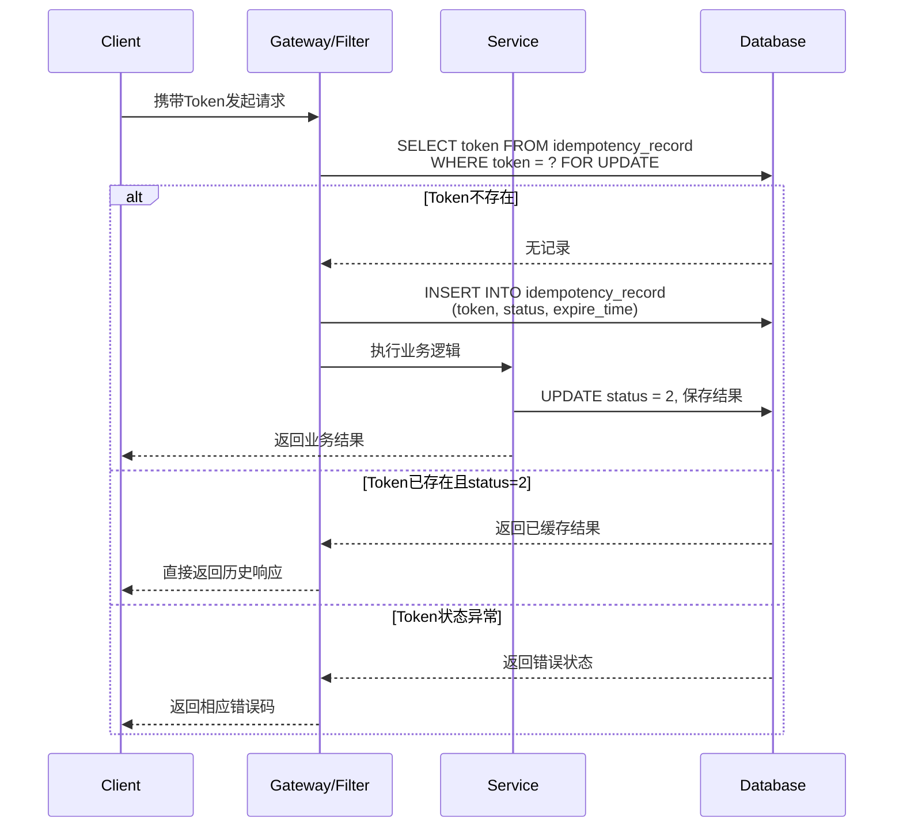

## 幂等性Token机制技术文档
### (服务端去重表 + 唯一索引实现方案)

---

### 1. 概述

**幂等性**是指同一操作的多次执行所产生的影响应与一次执行的影响相同。在分布式系统、微服务架构及网络不稳定的环境下，幂等性设计对保证数据一致性和防止重复操作至关重要。

**幂等性Token机制**通过客户端请求时携带唯一令牌，服务端校验令牌使用状态，确保同一业务请求仅被处理一次。本方案采用“服务端去重表 + 数据库唯一索引”双重保障，实现高可靠幂等控制。

---

### 2. 设计原理

#### 2.1 核心概念
- **幂等Token**：全局唯一的请求标识符，通常由客户端生成或服务端预生成
- **去重表**：服务端存储已处理Token的状态表
- **唯一索引**：数据库层防止重复Token插入的约束保障

#### 2.2 工作机制
```
客户端 → 生成/获取Token → 携带Token发起请求
服务端 → 校验Token状态 → 执行业务逻辑 → 更新Token状态
数据库 → 唯一索引约束 → 防止并发重复
```

---

### 3. 实现方案

#### 3.1 系统组件

##### 3.1.1 客户端
```java
// Token生成示例（可采用UUID、雪花算法等）
public class IdempotencyToken {
    public static String generateToken() {
        return UUID.randomUUID().toString().replace("-", "");
    }
}

// 请求携带Token（HTTP Header示例）
// X-Idempotency-Token: 550e8400e29b41d4a716446655440000
```

##### 3.1.2 服务端去重表设计
```sql
CREATE TABLE idempotency_record (
    id BIGINT AUTO_INCREMENT PRIMARY KEY,
    token VARCHAR(64) NOT NULL COMMENT '幂等令牌',
    business_key VARCHAR(128) NOT NULL COMMENT '业务标识',
    status TINYINT NOT NULL DEFAULT 0 COMMENT '状态:0-未处理,1-处理中,2-处理成功,3-处理失败',
    request_params TEXT COMMENT '请求参数快照',
    response_data TEXT COMMENT '响应结果缓存',
    expire_time DATETIME NOT NULL COMMENT '过期时间',
    created_at DATETIME DEFAULT CURRENT_TIMESTAMP,
    updated_at DATETIME DEFAULT CURRENT_TIMESTAMP ON UPDATE CURRENT_TIMESTAMP,
    
    -- 唯一索引（核心约束）
    UNIQUE KEY uk_token (token),
    -- 业务维度幂等（可选）
    UNIQUE KEY uk_business (business_key, status),
    
    KEY idx_expire_time (expire_time),
    KEY idx_created_at (created_at)
) ENGINE=InnoDB DEFAULT CHARSET=utf8mb4 COMMENT='幂等性记录表';
```

#### 3.2 处理流程

##### 3.2.1 请求处理时序


##### 3.2.2 核心校验逻辑
```java
@Component
public class IdempotencyService {
    
    @Transactional(rollbackFor = Exception.class)
    public IdempotencyResponse processRequest(IdempotencyRequest request) {
        // 1. 尝试插入Token记录（数据库唯一索引保障原子性）
        try {
            int inserted = idempotencyDao.insertIfAbsent(
                request.getToken(),
                request.getBusinessKey(),
                LocalDateTime.now().plusHours(2) // 2小时过期
            );
            
            if (inserted == 0) {
                // 2. Token已存在，查询处理结果
                IdempotencyRecord record = idempotencyDao.selectByToken(request.getToken());
                return handleExistingRecord(record, request);
            }
            
            // 3. 首次请求，执行业务逻辑
            BusinessResult result = businessService.execute(request);
            
            // 4. 更新记录状态和结果
            idempotencyDao.updateResult(request.getToken(), 
                IdempotencyStatus.SUCCESS,
                serialize(result));
            
            return IdempotencyResponse.success(result);
            
        } catch (DuplicateKeyException e) {
            // 并发请求处理：等待重试或直接查询
            return handleConcurrentRequest(request);
        }
    }
    
    private IdempotencyResponse handleExistingRecord(IdempotencyRecord record, 
                                                     IdempotencyRequest request) {
        switch (record.getStatus()) {
            case PROCESSING:
                // 异步轮询或超时处理
                return IdempotencyResponse.processing();
            case SUCCESS:
                // 返回缓存结果
                return IdempotencyResponse.success(deserialize(record.getResponseData()));
            case FAILED:
                // 根据业务决定是否重试
                return IdempotencyResponse.failed("Previous request failed");
            default:
                return IdempotencyResponse.error("Invalid token status");
        }
    }
}
```

#### 3.3 并发控制策略

##### 3.3.1 数据库层面
```sql
-- 使用SELECT ... FOR UPDATE实现行级锁
BEGIN TRANSACTION;
SELECT * FROM idempotency_record 
WHERE token = '{{token}}' FOR UPDATE;

-- 检查后插入或更新
INSERT INTO idempotency_record ... 
ON DUPLICATE KEY UPDATE ...;
COMMIT;
```

##### 3.3.2 分布式锁方案（可选）
```java
// Redis分布式锁防止集群并发
public boolean tryIdempotencyLock(String token, long expireSeconds) {
    String key = "idempotency:lock:" + token;
    return redisTemplate.opsForValue()
        .setIfAbsent(key, "1", expireSeconds, TimeUnit.SECONDS);
}
```

---

### 4. 关键配置

#### 4.1 Token规则配置
```yaml
idempotency:
  token:
    length: 32              # Token长度
    prefix: ${spring.application.name}  # 应用前缀隔离
    expire-hours: 24        # 默认过期时间
  storage:
    type: database         # 存储类型
    cleanup-enabled: true  # 启用清理任务
    cleanup-cron: "0 0 2 * * ?"  # 每天2点清理
```

#### 4.2 错误码定义
```java
public enum IdempotencyErrorCode {
    TOKEN_REQUIRED(400001, "幂等令牌不能为空"),
    TOKEN_INVALID(400002, "令牌格式无效"),
    TOKEN_EXPIRED(400003, "令牌已过期"),
    REQUEST_DUPLICATED(400004, "请求已被处理"),
    PROCESSING_TIMEOUT(400005, "处理超时，请稍后查询"),
    CONCURRENT_REQUEST(400006, "并发请求，请稍后重试");
}
```

---

### 5. 异常处理与容错

#### 5.1 降级策略
```java
@Slf4j
@Component
public class IdempotencyFallback {
    
    @Autowired
    private CircuitBreakerFactory circuitBreakerFactory;
    
    public IdempotencyResponse fallbackProcess(IdempotencyRequest request, Throwable t) {
        // 1. 熔断器保护
        CircuitBreaker cb = circuitBreakerFactory.create("idempotency");
        return cb.run(() -> {
            // 2. 降级逻辑：绕过幂等校验直接处理
            if (isDegradeRequired()) {
                log.warn("Idempotency degraded, processing directly");
                return directProcess(request);
            }
            throw new ServiceUnavailableException("Idempotency service unavailable");
        });
    }
    
    private boolean isDegradeRequired() {
        // 根据业务重要性决定是否降级
        return !BusinessContext.isCriticalOperation();
    }
}
```

#### 5.2 数据清理机制
```sql
-- 定期清理过期记录
DELETE FROM idempotency_record 
WHERE expire_time < NOW() 
LIMIT 1000; -- 分批清理

-- 归档历史数据（可选）
CREATE TABLE idempotency_record_archive LIKE idempotency_record;
```

---

### 6. 最佳实践

#### 6.1 Token设计原则
1. **全局唯一性**：确保不同业务、不同用户间的Token不冲突
2. **不可预测性**：避免使用连续ID，防止被遍历
3. **携带业务信息**：Token可编码业务类型、用户ID等信息
4. **时效性控制**：根据业务特点设置合理的过期时间

#### 6.2 性能优化
```java
// 1. 缓存热点Token状态
@Cacheable(value = "idempotency", key = "#token")
public IdempotencyRecord getCachedRecord(String token) {
    return idempotencyDao.selectByToken(token);
}

// 2. 异步状态更新
@Async
public void updateStatusAsync(String token, IdempotencyStatus status) {
    idempotencyDao.updateStatus(token, status);
}

// 3. 批量清理
@Scheduled(cron = "${idempotency.storage.cleanup-cron}")
public void batchCleanExpiredTokens() {
    // 分页批量删除
}
```

#### 6.3 监控与告警
```yaml
# Prometheus监控指标
metrics:
  idempotency:
    requests_total: "idempotency_requests_total"
    duplicate_requests: "idempotency_duplicate_requests"
    processing_time: "idempotency_processing_seconds"
    token_expired: "idempotency_token_expired_total"

# 关键告警规则
alerts:
  - name: HighDuplicateRate
    expr: rate(idempotency_duplicate_requests[5m]) > 0.1
    severity: warning
```

---

### 7. 注意事项

1. **Token生成责任方**
   - 可由客户端生成（需保证随机性）
   - 或服务端预颁发（增加一次交互）

2. **网络重试处理**
   - 客户端需保持同一Token进行重试
   - 服务端需支持幂等状态查询接口

3. **分布式事务场景**
   - 幂等表更新与业务操作需在同一事务中
   - 考虑最终一致性的补偿机制

4. **安全性考虑**
   - Token需防止被窃取重用
   - 敏感业务需结合身份验证
   - 限制单位时间内的Token申请频率

---

### 8. 扩展方案

#### 8.1 多级幂等控制
```java
// 结合本地缓存 + Redis + 数据库的三级校验
public class MultiLevelIdempotencyChecker {
    private ConcurrentHashMap<String, Boolean> localCache = new ConcurrentHashMap<>();
    private RedisTemplate<String, Boolean> redisTemplate;
    private IdempotencyDao idempotencyDao;
    
    public boolean checkMultiLevel(String token) {
        // 1. 本地缓存检查（最快）
        if (localCache.containsKey(token)) {
            return false;
        }
        
        // 2. Redis检查（分布式）
        if (Boolean.TRUE.equals(redisTemplate.hasKey(token))) {
            return false;
        }
        
        // 3. 数据库检查（最终保障）
        return idempotencyDao.checkToken(token);
    }
}
```

#### 8.2 业务维度幂等
```sql
-- 支持同一用户同一业务类型幂等
ALTER TABLE idempotency_record 
ADD UNIQUE KEY uk_user_business (user_id, business_type, business_key);
```

---

### 总结

本方案通过“服务端去重表 + 唯一索引”的核心设计，结合适当的并发控制和容错机制，实现了高可靠的幂等性保障。方案具有以下特点：

1. **强一致性**：数据库唯一索引确保绝对不重复
2. **高可用性**：支持降级和熔断保护
3. **易扩展性**：可灵活支持多级校验和业务维度幂等
4. **可观测性**：完善的监控和告警体系

在实际应用中，需根据具体业务场景调整Token生成策略、过期时间和清理策略，以在保证数据一致性的同时获得最佳性能表现。