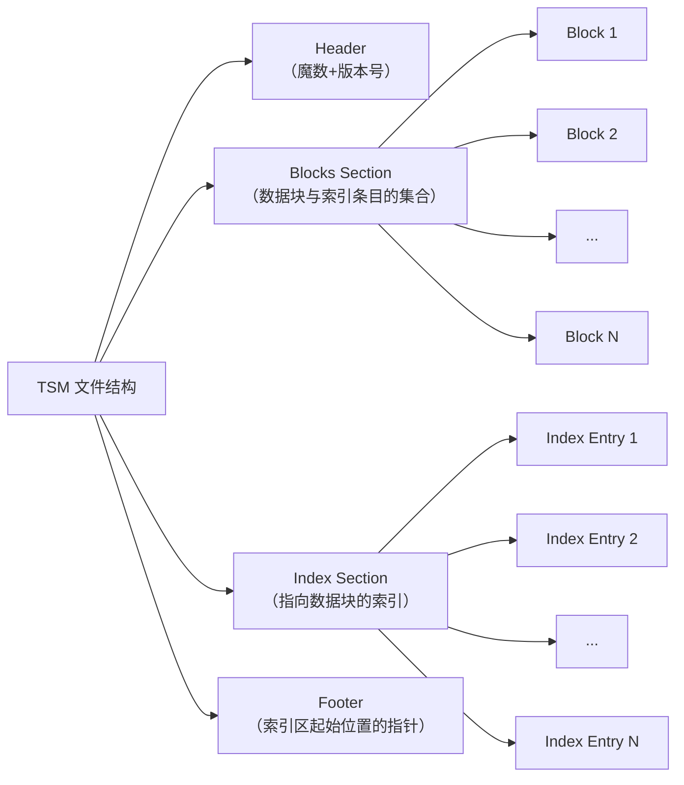

好的，遵照您的要求，我将为您生成一份关于 InfluxDB TSM 存储引擎的技术文档。

---

# **时序数据库 InfluxDB TSM 存储引擎技术解析**

## **文档摘要**

本文档深入探讨了 InfluxDB 的核心存储引擎——**TSM** 的设计理念、架构、关键工作流程以及优化机制。TSM 是为海量时序数据写入与高效时间范围查询量身定制的存储方案，通过其独特的存储结构、压缩算法和文件组织，解决了传统存储引擎在处理时序数据时面临的性能瓶颈。阅读本文，您将理解 TSM 如何实现高吞吐写入、高效存储和快速查询。

---

## **1. 引言：为何需要专门的时序存储引擎？**

时序数据具有显著的特征：
*   **高并发写入**：大量数据点持续高速涌入。
*   **按时间有序**：数据点天然带有时间戳，且数据到达大致按时间递增。
*   **价值密度低**：历史数据的精细粒度查询需求较少，通常按时间窗口进行聚合分析。
*   **写多读少**：写入负载远高于随机读取负载。

传统存储引擎（如 B-Tree 的 LSM-Tree 变种）在处理此类场景时，在写入放大、存储空间和查询效率上面临挑战。TSM 正是在此背景下，借鉴了 LSM-Tree 的思想，并针对时序数据特性进行了深度优化。

## **2. TSM 存储引擎概览**

**TSM** 代表 **Time-Structured Merge Tree**。它的核心目标可概括为：
1.  **最大化写入吞吐**：通过 WAL、内存缓冲和批量刷盘实现。
2.  **极致数据压缩**：针对不同类型的时间序列值采用高效的专用压缩算法。
3.  **高效的时间范围查询**：通过索引结构快速定位包含特定时间范围的数据文件和数据块。

其宏观数据流向如下图所示：

```mermaid
flowchart TD
    subgraph Write Path
        A[写入请求] --> B[写入 Write-Ahead Log<br/>（WAL）]
        B --> C[写入内存结构<br/>（Cache & Write-Ahead Log）]
        C --> D{内存表是否已满？}
        D -- 是 --> E[快照并异步刷盘<br/>形成 TSM 文件]
        E --> F[更新索引<br/>（TSI文件）]
        D -- 否 --> C
    end

    subgraph Read Path
        G[时间范围查询请求] --> H[查询索引<br/>（TSI文件）]
        H --> I[定位相关<br/>TSM文件及数据块]
        I --> J[从Cache/TSM文件中<br/>读取并合并数据]
        J --> K[返回查询结果]
    end

    Write Path --> Read Path
```

## **3. 核心架构与组件**

### **3.1 存储层次结构**

TSM 采用分层存储，数据从内存最终沉降到只读的磁盘文件中。

1.  **Write-Ahead Log (预写日志)**
    *   **目的**：保证数据持久性，防止内存数据丢失。
    *   **机制**：每个写入请求首先以顺序追加的方式写入 WAL 文件。在系统恢复时，通过重放 WAL 来重建内存状态。

2.  **Cache**
    *   对应内存中的存储结构，是 **`map[SeriesKey]map[timestamp]value`** 的形式。
    *   当缓存达到阈值（如 `cache-snapshot-memory-size`）时，会触发快照并转换为下一级的 TSM 文件。

3.  **TSM File**
    *   磁盘上的**只读**、**高度压缩**、**不可变**的数据文件，是 TSM 引擎的基石。文件扩展名为 `.tsm`。

4.  **TSI File (Time Series Index)**
    *   自 InfluxDB 1.5+ 引入的**磁盘索引**，用于替代纯内存的索引。
    *   解决了随着时间线（Series）数量爆炸式增长，内存索引占用过大问题。
    *   它将时间线的元数据（measurement， tag keys/values, field name）持久化到磁盘，通过倒排索引等结构支持高效的条件过滤查询。

### **3.2 TSM 文件格式详解**

一个 `.tsm` 文件由四个部分组成，如下图所示：



1.  **Header**：8字节，包含 4 字节的魔数（`0x16D116D1`）和 1 字节的版本号。
2.  **Blocks**：实际存储压缩后的时序数据块。每个块属于一个唯一的 **Series Key + Field**。
3.  **Index**：存储索引条目（Index Entry）的列表。每个 Index Entry 对应一个数据块，包含：
    *   **Key**：Series Key + Field。
    *   **Block Type**：标识数据块的压缩类型（如整型、浮点数、字符串等）。
    *   **Min Time & Max Time**：该数据块内时间戳的最小值和最大值（**实现高效时间范围过滤的关键**）。
    *   **Offset**：该数据块在文件中的起始位置。
    *   **Size**：该数据块的长度。
4.  **Footer**：8字节，存储 Index Section 在文件中的起始偏移量。

**关键特性**：
*   **数据按时间窗口分块**：一个 Series 的数据被切割成多个连续时间窗口的 Block。
*   **索引与数据分离**：读取时，先加载索引（可缓存），根据查询条件（Series Key, Time Range）快速定位到可能包含数据的 Block，避免扫描全部数据。
*   **列式存储思想**：在每个 Block 内部，时间戳和值是分开存储的两列，便于分别进行高效的压缩。

### **3.3 压缩算法**

TSM 的压缩效率是其核心优势之一，它**针对不同的数据类型采用不同的无损压缩算法**：

*   **时间戳列**：由于时序数据时间戳通常递增且间隔均匀，采用差分编码（Delta Encoding）将时间戳转换为差值序列，然后使用简单的运行长度编码（RLE）或适合整数的编码（如 Simple8b）进行压缩，压缩比极高。
*   **浮点数列**：使用 Facebook 开源的 **Gorilla 浮点数压缩算法**。该算法利用相邻浮点数的 XOR 结果通常前导零和后导零较多的特性，只存储有变化的部分，对传感器、指标类数据效果极佳。
*   **整数列**：使用 Simple8b 或类似编码，根据数值范围动态选择最优编码方式。
*   **布尔列/字符串列**：分别采用 RLE 和 Snappy 等通用压缩算法。

## **4. 关键工作流程**

### **4.1 写入流程**
1.  写入请求到达。
2.  数据首先被序列化并追加写入 WAL。
3.  数据被插入内存中的 Cache（结构为 `map[SeriesKey]map[timestamp]value`）。
4.  当 Cache 大小达到阈值，或到达固定时间间隔时：
    a. 当前活跃的 WAL 文件被关闭，新的写入使用新的 WAL 文件。
    b. Cache 被 **“快照”** 为一个只读的 `snapshot`。
    c. 后台 `compact` 进程将 `snapshot` 中的数据按 Series Key 排序，按时间窗口分割成 Block，对各列进行压缩，并生成对应的索引条目，最终写入一个新的 TSM 文件。
    d. 新的 TSM 文件创建后，对应的旧 WAL 文件可以被删除。
5.  索引（TSI）被异步更新，以反映新的数据。

### **4.2 读取流程**
1.  查询请求（如 `SELECT value FROM measurement WHERE tag=‘x’ AND time > now() - 1h`）到达。
2.  查询引擎首先使用 **TSI 索引**，根据 `measurement`、`tag` 条件找到所有满足条件的 Series Key。
3.  对于每个相关的 Series Key，引擎需要获取指定时间范围内的数据。
4.  引擎会同时检查 **Cache** 和 **磁盘上的 TSM 文件**。
5.  对于每个 TSM 文件，引擎读取其 **Index Section**（如果不在内存中则加载），通过二分查找定位到那些 `[MinTime， MaxTime]` 与查询时间范围有交集的 Index Entry。
6.  根据 Index Entry 中的 `Offset` 和 `Size`，精确读取一个或多个数据 Block 到内存。
7.  将 Block 解压，得到原始的时间戳-值序列。
8.  合并来自 Cache 和多个 TSM 文件的数据，并按时间戳排序后返回。

### **4.3 压缩合并流程**
这是 TSM 引擎的“垃圾回收”和性能优化过程，由多个层级的压缩策略组成：
*   **Level 1 (Snapshot)**：将 Cache 快照为 TSM 文件。
*   **Level 2-3**：将多个小的、时间窗口重叠的 TSM 文件合并成更大的文件，消除冗余数据（如相同 Series 的数据被分散在多个文件），并进一步优化排序和压缩。
*   **Level 4 (Full/优化压缩)**：将多个大的 TSM 文件合并成一个，并 ** 按时间和 Series Key 完全排序**，形成最优的查询结构。此过程会彻底清理被标记删除的数据。

## **5. 性能特点与权衡**

*   **优势**：
    *   **写入吞吐量极高**：顺序写 WAL + 内存缓冲 + 批量刷盘。
    *   **存储空间占用小**：专用的列式压缩算法。
    *   **时间范围查询极快**：基于时间的索引和有序存储。
    *   **高数据保留率支持**：通过分层压缩，管理海量历史数据成本更低。

*   **劣势与挑战**：
    *   **删除操作代价高**：删除是逻辑标记，需要等待压缩合并时才能物理回收空间。
    *   **点查效率相对较低**：如果查询单个分散的时间点，可能需要访问多个 TSM 文件。TSM 并非为随机点查优化。
    *   **索引重建耗时**：如果 TSI 索引损坏，重建过程对大量时间线可能非常缓慢。
    *   **冷读延迟**：查询未在缓存中的历史数据时，需要磁盘寻道和读块。

## **6. 总结**

TSM 存储引擎是 InfluxDB 能够胜任高性能时序数据场景的核心。它通过 **LSM-Tree 的变体管理写入**，通过 **列式存储和专用压缩节省空间**，通过 **基于时间的索引组织支持高效范围查询**。理解 TSM，有助于我们更好地设计数据 Schema（如合理设置 `SHARD DURATION`），进行性能调优，并理解其行为边界，从而在运维和开发中做出更合理的决策。

随着 InfluxDB 3.0（InfluxDB IOx）的推出，其存储引擎已转向基于 Apache Arrow 和 Parquet 的实时分析架构，以更好地统一时序和数据分析负载。但 TSM 引擎在 1.x 和 2.x 版本中仍是经典且成熟的设计，其核心思想对理解时序数据库存储优化具有重要参考价值。

---
**附录：关键配置参数示例 (influxdb.conf)**

```conf
[data]
  # WAL 目录
  dir = "/var/lib/influxdb/wal"
  # 数据文件（TSM）目录
  engine-path = "/var/lib/influxdb/data"
  # 触发 Cache 刷盘的阈值
  cache-snapshot-memory-size = "25m"
  # 压缩合并的并发数
  compact-throughput = "48m"
  compact-throughput-burst = "48m"
```